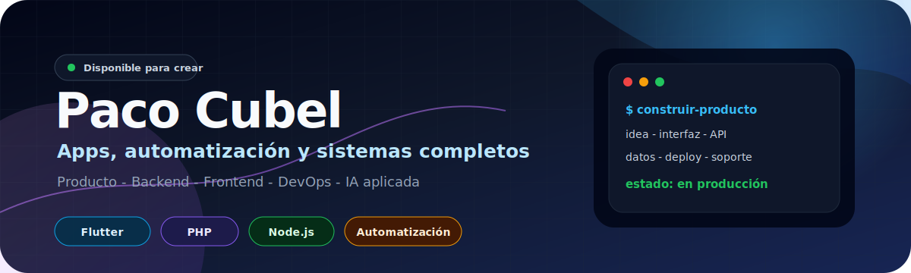

  

<h1 align="center">Paco Cubel</h1>

  <strong>Construyo productos digitales completos:</strong> idea, interfaz, backend, automatización, despliegue y mantenimiento.

  
  
  
  

## Qué hago

<table>
  <tr>
    <td width="33%">
      <h3>Producto</h3>
      
Convierto ideas en herramientas utilizables, con foco en resolver problemas reales y mantener el proyecto vivo después del lanzamiento.

    </td>
    <td width="33%">
      <h3>Aplicaciones</h3>
      
Desarrollo apps multiplataforma, paneles, webs y utilidades internas cuidando la experiencia, el rendimiento y la mantenibilidad.

    </td>
    <td width="33%">
      <h3>Sistemas</h3>
      
Integro backend, bases de datos, automatizaciones, despliegues, backups y procesos para que el producto funcione de punta a punta.

    </td>
  </tr>
</table>

## Stack habitual

  
  
  
  
  
  
  

## Actividad

<table>
  <tr>
    <td width="38%">
      
    </td>
    <td width="62%">
      
    </td>
  </tr>
</table>
