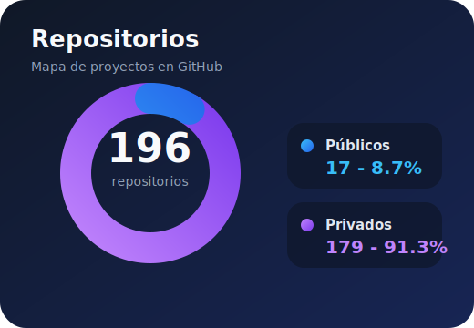
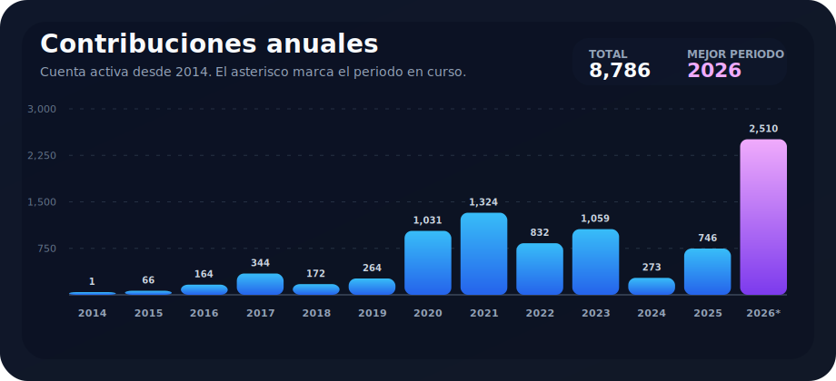

# Paco Cubel

Construyo apps, herramientas y sistemas propios, normalmente de punta a punta: producto, backend, frontend, automatizacion y operaciones.

## En numeros

  

Dato manual: 196 repositorios en GitHub. 17 publicos y 179 privados.

## Contribuciones anuales

  

La grafica de contribuciones se actualiza automaticamente con GitHub Actions. Las estadisticas de proyectos son manuales para mantenerlo simple.
